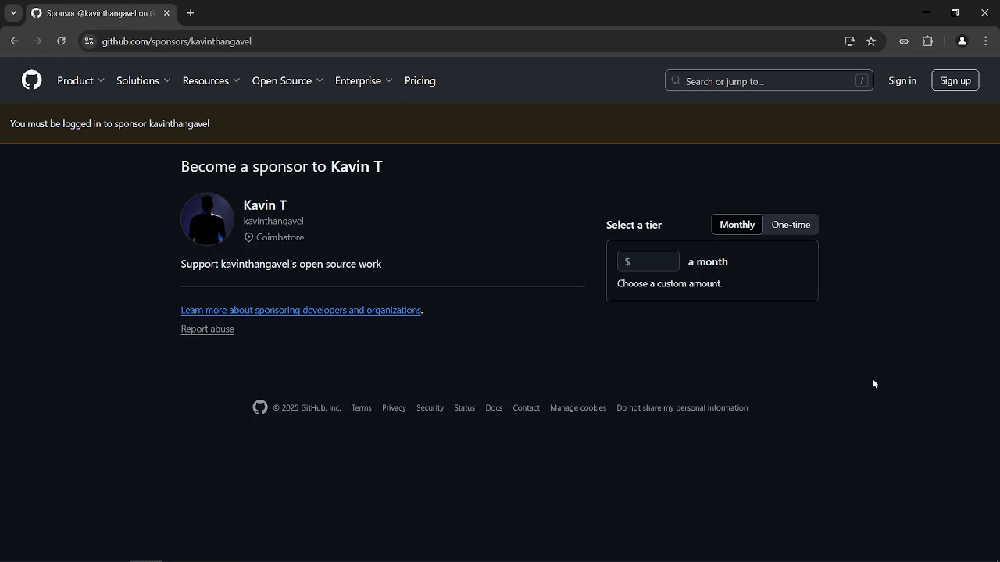

# ClipFast - Browser Extension

A browser extension that provides quick URL sharing capabilities with one-click copying, social media sharing, and QR code generation.

## Features

- 🚀 One-click URL copying to clipboard
- 📱 Use OS Native Share Feature (Only in Chromium Browsers)
- 🔄 Generate QR codes for quick mobile sharing (Only in Firefox)
- 🖥️ Clean and intuitive Share popup interface for Firefox
- 🌐 Cross-browser support (Chrome, Firefox, Edge)
- 📋 Clipboard integration with success/error feedback

## Installation

**Chrome Web Store** :

  

**Firefox Addon** :

  

### Prerequisites
- Modern browser (Chrome 80+, Firefox 78+, Edge 85+)
- Git (for development setup)
- Basic understanding of browser extensions

### For Users
1. **Chromium Browsers:**
   - Clone repository: `git clone https://github.com/ByteTrix/clipfast.git`
   - Run "build.ps1" 
   - Visit `chrome://extensions`
   - Enable "Developer mode"
   - Click "Load unpacked" and select the extension directory "dist/chrome"

2. **Firefox:**
   - Clone repository: `git clone https://github.com/ByteTrix/clipfast.git`
   - Run "build.ps1" 
   - Visit `about:debugging#/runtime/this-firefox`
   - Click "Load Temporary Add-on.."
   - Select the extension manifest file "dist/firefox"

